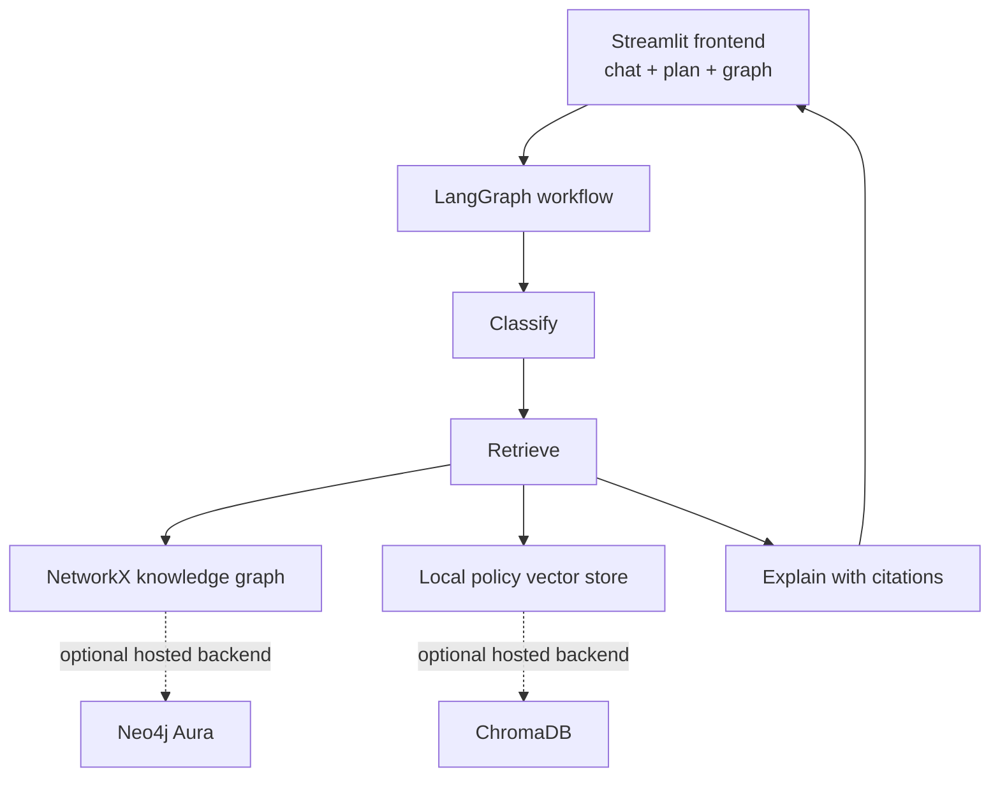

# Hackathon Architecture

The repository supports two presentation surfaces over the same academic domain
services:

- `streamlit_app.py` is the fast demo surface for advisor chat, degree progress,
  and prerequisite graph visualization.
- `backend/server.py` remains the REST and static-web surface for the existing
  multi-page application.
- `src/agents/langgraph_workflow.py` exposes a classify -> retrieve -> explain
  LangGraph workflow. If LangGraph is unavailable, it executes the same steps
  locally so the demo still works offline.
- `src/knowledge_graph` provides the NetworkX implementation used as the zero-
  dependency graph fallback.
- `src/rag` provides the local retrieval implementation used when a hosted vector
  service is unavailable.

## Runtime Flow



## Demo Commands

```powershell
python -m pip install -r requirements.txt
streamlit run streamlit_app.py
```

For the existing REST interface:

```powershell
python -m uvicorn backend.server:app --host 0.0.0.0 --port 8000 --reload
```

Neo4j and Chroma are intentionally shown as optional upgrade points. The default
path avoids external graph/vector services and therefore works at a venue without
reliable Wi-Fi.