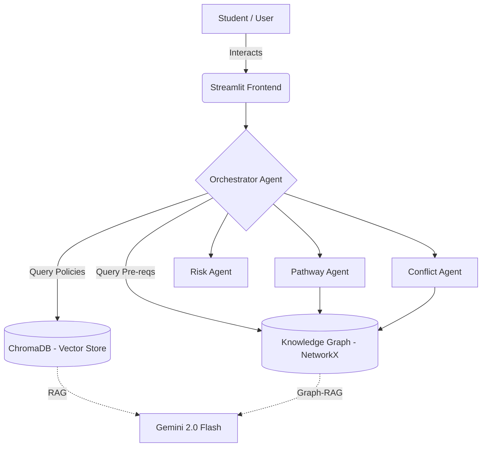

# 🎓 Graph-RAG Academic Advisor AI

## 💡 Problem Statement
University students often struggle to plan their academic journeys effectively. Complex prerequisite chains, hidden bottleneck courses, and dense university policies lead to delayed graduations, schedule conflicts, and frustration. Traditional degree audits are static and don't provide intelligent, pathway-based suggestions.

## 🏗️ Architecture



## ✨ Features
- **📊 Interactive Dashboard**: View degree progress, completed courses, and risk assessments.
- **🗺️ Pathway Planner**: Auto-generate the optimal path to graduation using Graph-RAG and constraint engines.
- **🔍 Course Explorer**: Visualize the university curriculum as an interactive Knowledge Graph (PyVis).
- **💬 AI Advisor**: Chat with an intelligent agent powered by Gemini 2.0 Flash, grounded in university policies (RAG) and course dependencies.
- **⚠️ Conflict Checker**: Validate schedules against prerequisite rules and credit load limits.

## 🛠️ Tech Stack
- **Frontend**: Streamlit
- **LLM / AI**: Gemini 2.0 Flash, Langchain, Langgraph
- **Data Stores**: ChromaDB (RAG Vector Store), NetworkX (Knowledge Graph)
- **Visualizations**: PyVis
- **Models**: Pydantic v2

## 🚀 Setup Instructions

1. **Clone the repository:**
   ```bash
   git clone https://github.com/yourusername/graph-rag-advisor.git
   cd graph-rag-advisor
   ```

2. **Set up a virtual environment:**
   ```bash
   python -m venv venv
   # On Windows
   venv\Scripts\activate
   # On Mac/Linux
   source venv/bin/activate
   ```

3. **Install dependencies:**
   ```bash
   pip install -r requirements.txt
   ```

4. **Environment Variables:**
   Copy the example env file and add your Gemini API Key.
   ```bash
   cp .env.example .env
   ```

5. **Run the Application:**
   ```bash
   streamlit run app/app.py
   ```

## 📸 Screenshots
*(Placeholder - Add your screenshots here after the hackathon!)*

## 👥 Team
- **Team Name**: Graph-RAG Innovators
- **Members**: (Add members here)

## 📄 License
MIT License
